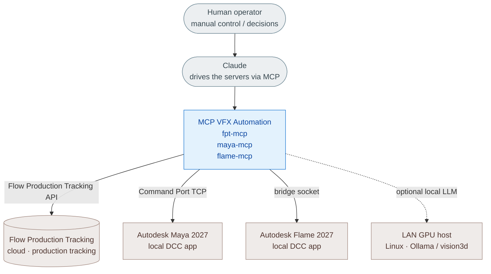
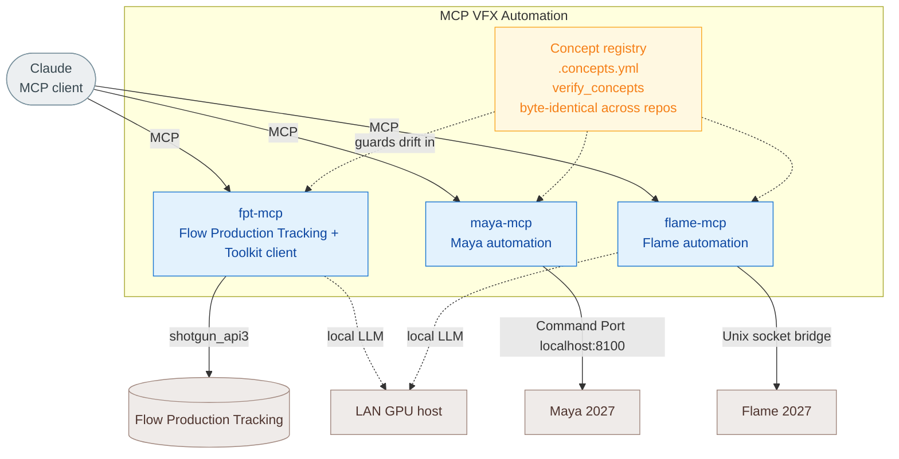
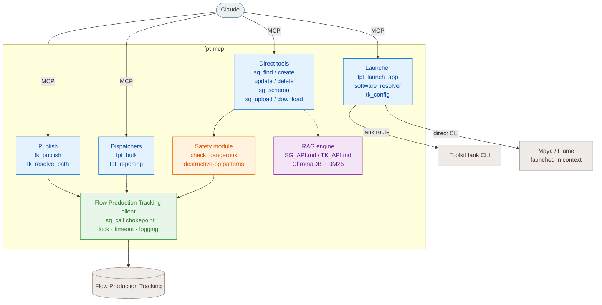

# Architecture

The same system at increasing zoom (the **C4 model**): start at the map, descend
into detail only when needed. Each box shows its name on the first line and its
contents below. Colour carries meaning (see legend). The deepest level (code) is
generated automatically by Graphify (god nodes, call-flow) — not redrawn here.

> **Colour legend** — blue = my code (servers / tools / logic) · amber = safety & validation ·
> purple = knowledge / RAG · green = connectivity / bridge · teal = state / journal ·
> yellow = governance / concept registry · tan = external systems & apps · grey = actors.

## Level 1 — System Context (the map)

## Level 2 — Containers (the three servers)

## Level 3 — Components (fpt-mcp)

For function-level code use the Graphify graph of `src/`.

## Level 4 — Code (deepest zoom)

Below components is the actual code (functions, classes, call paths). It is
generated on demand by **Graphify** (god nodes, call-flow, interactive graph) —
run it over `src/` rather than maintaining it by hand.

*C4 levels: 1 Context → 2 Containers → 3 Components → 4 Code. Top-down for
understanding; Graphify owns the bottom.*
